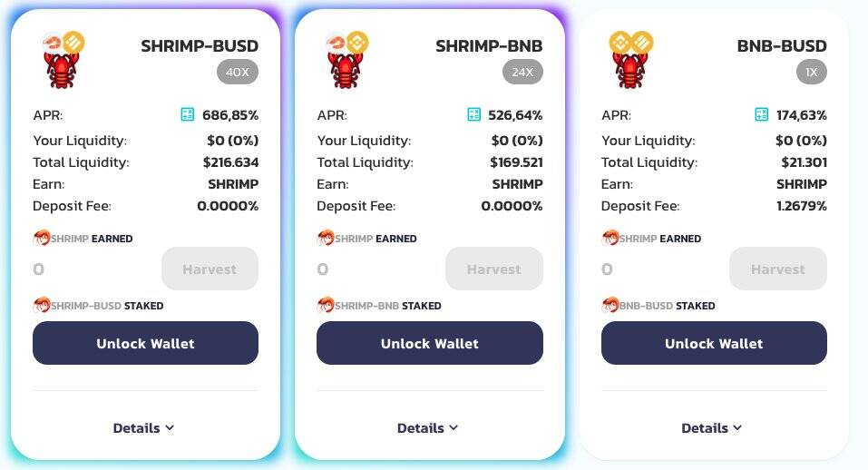

# ShrimpSwap

我们认为，当前的收益农场生态系统正在遭受超通缩，即区块链中代币的总体价格大幅下跌。这导致通货紧缩的螺旋式上升，导致代币升值减少、年利率 (APR) 降低以及对代币的总体需求降低，从而导致存款水平下降。这种情况会造成通缩环境，不符合相关各方的利益。
为了解决这个问题，我们在币安智能链中开发了一个合约，以对抗生态系统的地方性过度通货紧缩并增加投资者的信心；引入 SHRIMP 通缩代币。我们将最大供应量限制为 2100 万只虾。
存款费用将随着时间的推移而降低，最初设置为 3%，在 60 天结束时将达到 0%。

