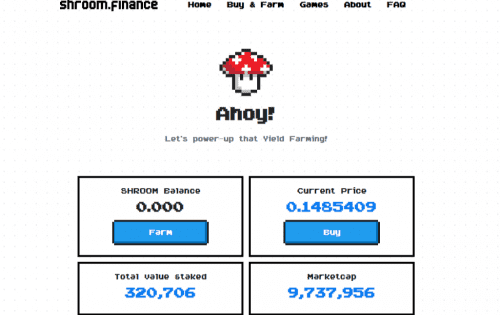

# Shroom.Finance

Shroom 是一个 DeFi 协议和 DAO，专注于游戏内资产的铸造、发布和交易。该协议 100% 由其社区驱动、拥有和管理，没有中央方或中间人。
我们正在为真正去中心化的生态系统奠定基础，使这些虚拟物品能够铸造、最终所有权和跨平台交易，这将帮助游戏开发者解耦并轻松引导他们的游戏内经济结构和货币系统。
虚拟物品、可替代和不可替代的代币 (NFT) 无疑正在成为加密货币的下一个大趋势，但已在游戏中使用多年。我们才刚刚开始触及这个即将成为蓬勃发展的行业的皮毛，而 DeFi 领域的最新创新为我们带来了巨大的机遇。

