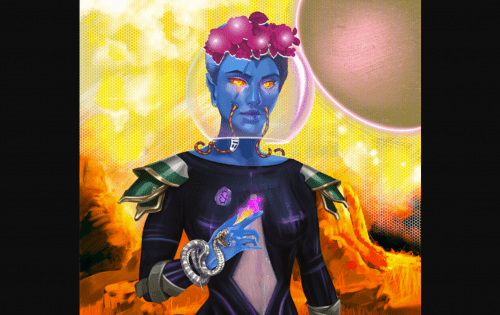

# Sidus NFT Heroes

SIDUS：NFT Heroes 是由 NFT STARS 和国际现代艺术家集体 NFT256 创建的 6,000 个生成角色的集合。该系列包含 4,000 名原创 NFT 英雄、1,000 名稀有英雄、500 名传奇英雄和 500 名合作 NFT 英雄。只有最初的 4,000 个可供购买，其余的都是使用升级卡和 Galaxy Modificator 创建的。根据传说，每个英雄都是从 12 个区块链行星之一（Bitcoione、Avalanya、Polygopus、Tronguan 等）来到独立城市 SIDUS。每个英雄的家乡星球都在他们的外表、性格和盔甲上留下了印记。未来，SIDUS 系列将转变为一个游戏虚拟世界，其中每个 sidus 英雄都可以访问游戏。 Sidus 不仅仅是一个游戏，而是一个充满无限机会的奇妙旅程！

