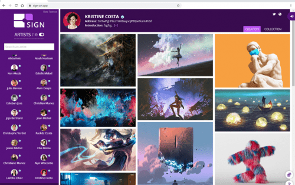

# SIGN Art

xxxxxxxxxx SIGN Art 是区块链认证数字艺术的网络画廊。艺术家可以选择通过将每个作品永久链接到一个独特的不可替代代币或 NFT 来标记他们的创作，并作为单个或限量版出售。收藏家可以使用该平台展示他们的 NFT 收藏，转移或赠送给任何 Waves 账户，并*在二级市场上出售。SIGN Art dApp 建立在 Waves 协议之上，该协议执行即时交易，具有固定的低成本费用。每个购买请求都会在链上免费铸造 NFT。该平台需要 $SIGN 实用代币供艺术家管理个人资料和创作。数字创作可以以 $SIGN、$WAVES 或 $USDN 的价格出售

