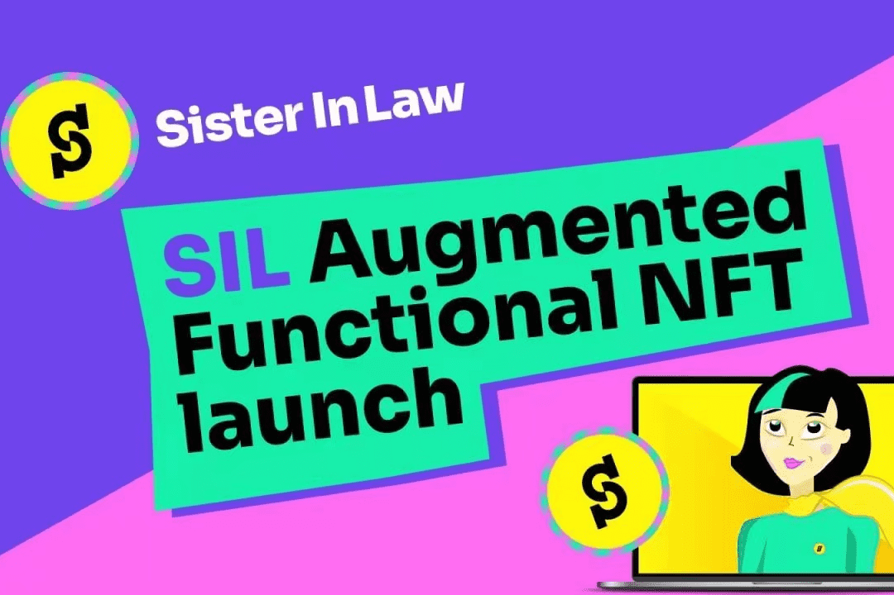

# SIL FINANCE

SIL.Finance 是一个单面收益聚合器（一键对冲），带有冒险功能的 NFT 农卡插件。SIL 的模型在 DeFi 市场上是独一无二的，它的单面功能完全由用户贡献，产品提供了所有可能的选择回到社区。SIL.Finance是一个单边一键对冲工具，并有丰富的NFT功能性卡片作为扩展性。严格意义上来讲，SIL是一个基于智能合约的去中心化自动投资平台，专注于为用户提供DeFi金融管理服务。SIL为可变互换、自动LP匹配和自动复利提供双代币流动性。根据年化收益率、安全系数、财务管理周期等因素，自动选择和配置最适合用户收益的产品，使复杂的流动性挖矿变得简单。

