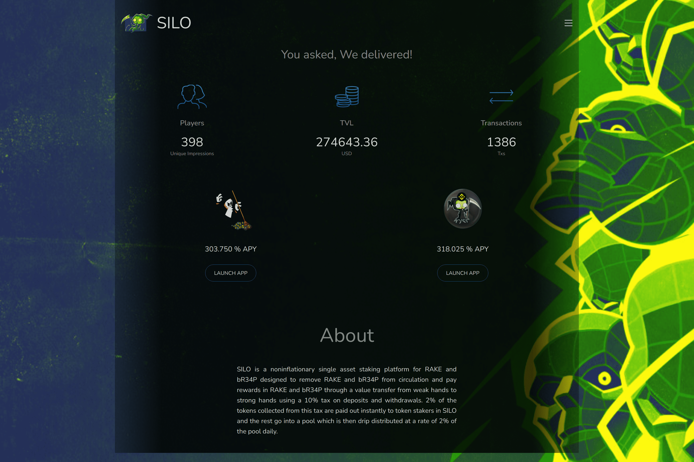

# SILO

SILO 是一个用于 RAKE 和 bR34P 的非通胀单一资产抵押平台，旨在将 RAKE 和 bR34P 从流通中移除，并通过使用 10% 的存款和取款税从弱手到强手的价值转移来支付 RAKE 和 bR34P 奖励。从这项税收中收取的 2% 的代币立即支付给 SILO 中的代币质押者，其余的进入一个池子，然后以每天池子的 2% 的速度滴注分配。
SILO 是一种面向未来的复合 BSC 利润的方式。对存款和取款征收 10% 的交易税，分配如下：收取的费用 100% 分配给社区。从这项税收中收取的 2% 的代币立即支付给 SILO 中的代币质押者，其余的进入一个池子，然后以每天池子的 2% 的速度滴注分配。

