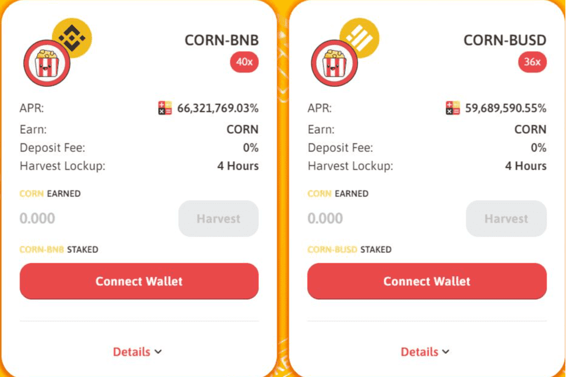

# SimplyCornSwap

我们的任务
关于我们
SimplyCornSwap 是一个跨多个网络的新时代 DEX 平台。出于扩展去中心化金融空间的需要，我们选择了基于信任和具有更大影响力的不断发展的技术创建的 DeFi 生态系统。补充 NFT 的多功能性是 DeFi 的下一个演变，我们致力于此。我们的社区将成为一个友好、安全和开放的社区反馈空间。其目的是跨链发展 SimplyCornSwap 社区，在每个农场、公用事业和代币中建立良好的声誉。
我们的使命是保持项目简单而有利可图，而不是让事情变得过于复杂！有一些有趣的复杂想法可以用来攫取投资者的钱并浪费掉。这不是我们的目的......我们希望确保投资者的经验成为关注的中心，并通过为投资者提供他们需要的东西来满足他们的需求。我们本质上是农民，我们是链上惊人技术的投资者，我们有勇气证明我们和外面的任何人一样好。我们将继续在这个领域与其他令人惊叹的 Dapps 一起建立在成功基础上的存在。

