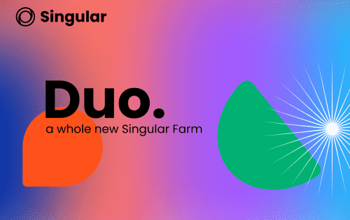

# Singular Farm

Singular 是一个多链、去中心化、战略收益最大化的农场，运行在 Binance Smart Chain、Fantom、Avalanche、Polygon 上。用户受到我们独特的三重农业系统的激励。今天的 SingularFarm 实时价格为 0.008580 美元，24 小时交易量为 17.94 美元。我们实时更新我们的 SING 至美元价格。 SingularFarm 在过去 24 小时内上涨了 1.63%。当前 CoinMarketCap 排名为 #7646，实时市值不可用。循环供应不可用，最大。供应 1,200,000 SING 硬币。

Singular 是一个多链、去中心化的战略收益农场，在 Polygon、BSC、Fantom 和 Okchain 上运行。我们的三重耕作系统激励了用户。

什么是三重耕作系统？

1.Yield Farming赚取$SING：通过质押LP代币

2. 战略农业获得$BANANA或$CAKE或$BOO的额外奖励（取决于链，例如，如果您在Polygon链上质押LP代币将获得$BANANA）：您将获得代币（$BANANA或$CAKE或 $BOO) 取决于您所在的链。 （不用担心，您无需做任何事情！只要您在我们的收益农场提供 LP 代币，这种战略性耕作就会自动开始。

