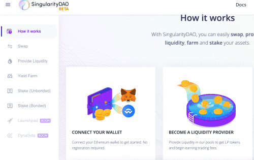

# SingularityDAO

SingularityDAO 是一个真正的去中心化自治组织，旨在简化对加密经济的访问。 AI-DeFi：尖端的去中心化金融与世界上最先进的去中心化人工智能相结合，创造一种新型经济。
AI 驱动的 DeFi 产品组合：由尖端人工智能控制的各种加密代币篮子。
从一个简单的地方轻松管理 DeFi 代币组合：DynaSet 在一份合约中以动态比例持有多个 DeFi 代币
每个 DynaSet 都拥有一组多样化的代币，这些代币按照 AI 动态调整的比例捆绑在一起。
由 SingularityNET 提供的 AI 领先技术。

