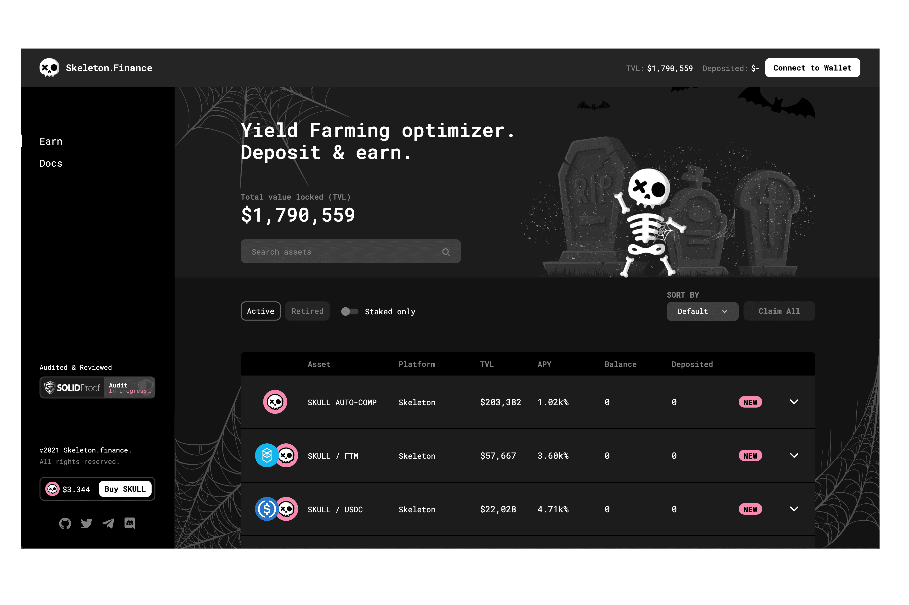

# Skeleton Finance

Skeleton.finance 是 Fantom Opera 上的收益优化器。用户可以存入各种代币并获得自动复利的收益。 SKULL 代币在其收益之上作为额外奖励给予。 SKULL 代币是 Skeleton.finance 的本地收益农业代币。 SKULL 持有者收到协议费用，并将能够对协议更改进行投票。Skeleton.finance 是 Fantom 主网中新推出的收益优化器协议。该项目的收益优化方法是使用中央合同轻松管理不同的投资池。然后，该中央合约附加到不同的其他策略合约，这些合约直接与每个 3rd 方农场的基础 Masterchef 交互。除了自动组合功能之外，这些矿池还使用其原生代币 SKULL 奖励用户。

