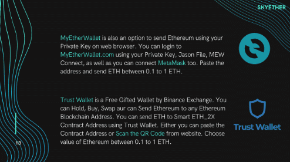

# skyether

没有游泳池。您可以购买和多个。很简单：0.1 eth 变成 0.2 eth，1 eth 变成 2 eth。Skyether 是一个去中心化的投资平台。它由以太坊区块链提供支持，可立即使您的投资翻倍。skyether dApp 是一种基于以太坊协议的高风险类别的加密资产。现在，根据用户数量，它在一般 dApp 排名中排名第 4470 位，在高风险类别中排名第 785 位，这让您可以很好地了解 skyether dApp 在其竞争对手中的表现。

通过分析最近 30 天窗口中的 skyether dApp 数据，很明显 dApp 的余额为 272.05 美元，交易量稳定在 0.00 美元。 skyether 在 30 天内产生了 0 笔交易，变化为 0%。显然，与之前的 7 天相比，成交量稳定了 0%。最近 7 天的数据显示，skyether 用户基数为 0，并且稳定了 0%。

我们还建议查看 skyether 活动概览和智能合约余额图表，了解这些重要指标如何随时间波动和变化。

