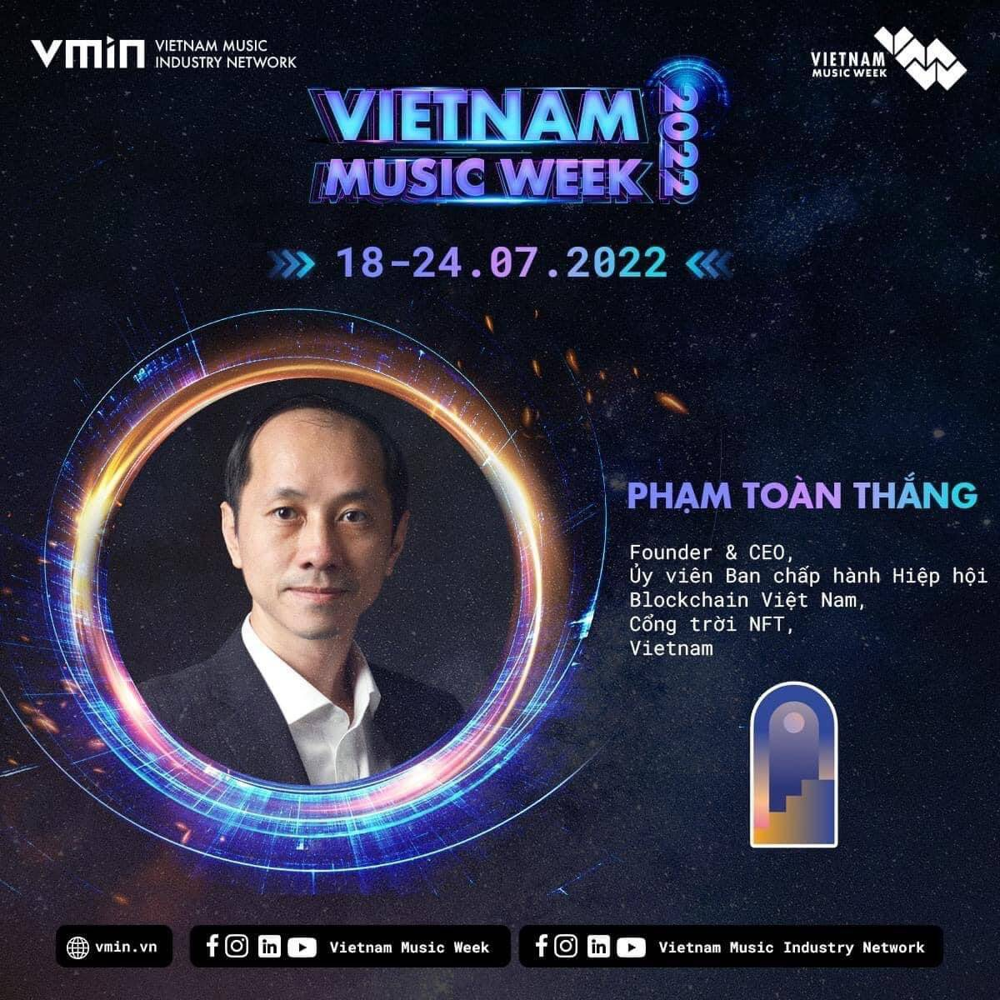

# SkyGate

区块链技术的发展激发了我们坚定的信念，投入所有资源打造 Sky Gate——越南开创性的 NFT 市场。不仅是 NFT 艺术——这一趋势在整个 2021 年在世界范围内强烈爆发，SkyGate 还面临着使 NFT 成为实际应用的挑战，在生活和交易活动中更加明显，便利性和透明度是重中之重。
所有个人、艺术家、收藏家和传统企业都可以通过KardiaChain构建和开发的区块链网络铸造/存储/发送/交易NFT产品。NFT的所有权有权使用这些产品的数字化认证所附带的产品和服务和服务。
SkyGate 的使命是创建一个热爱文化、了解技术并准备在技术世界中强劲发展的社区。

