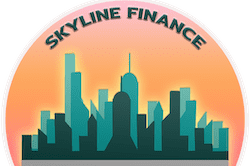

# SkylineFinance

转让税自动燃烧机制自动流动性反鲸鱼收获锁定推荐计划
主要特点
收获锁定期为 5 天，第一个收获日期为星期一。
‌
以下是我们产品中将使用的主要功能。
‌
每笔交易（发送、交换、耕种等）都将收取 7.5% 的转让税。
在 PancakeSwap V2 或其他 AMM 上使用 8% 以上的滑点购买 SKY。
如果滑点低于 7.5%，交易将失败
‌
每笔交易将燃烧 7.5% 转让税的 30%（交易金额的 2.25%）。
‌
SKY 的每笔交易都将被收取 7.5% 的转让税。 7.5% 转让税的 70%（交易金额的 5.25%）将通过合约自动添加到流动性池中，以不断提高价格下限。流动性将被锁定且无法访问。
‌
超过总供应量 0.5% 的交易将被拒绝。随着总供应量的增加，这个比例会降低。
‌
我们使用基于时间的收获锁定。收获锁定是一种独特的奖励锁定机制，用于限制收获的频率。它旨在防止农业套利机器人不断收获和倾销。
Skyline Referral 是一个独特的链上推荐计划，让用户无需存入任何代币即可赚取 $SKY。您只需推荐其他用户参与农场和质押池，您将获得他们永久获得的 3% 的奖励。

