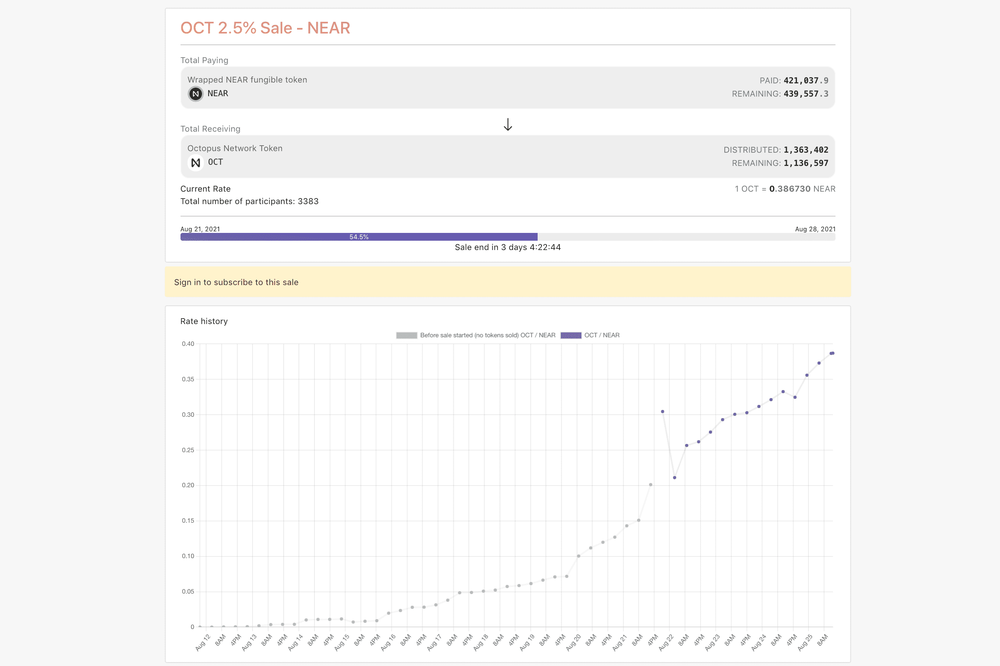

# Skyward Finance

Skyward Finance 是一个完全无需许可的开源启动板，它允许项目通过能够抵抗机器人和女巫攻击的最佳价格发现机制在没有任何流动性的情况下启动他们的代币。
Skyward Finance 的使命是为基于 NEAR 协议的项目实现公平的代币分配和价格发现。
从历史上看，项目通过集中拍卖、DEX 产品和固定成本销售进行初始代币分发，由于地理位置限制参与，容易受到前端运行机器人、女巫攻击、多账户注册和价格不明确，这是不公平的发现。私人销售和风险投资限制了公众从零开始通过以低价分发大量代币来获取代币的能力，这为私人方和人脉广泛的参与者提供了优势。这也伤害了项目创始人，他们在创业之旅的早期阶段资源紧张，没有成熟的网络来获得初始资金。推动项目分发和成功的是社区，因此我们认为从一开始就让其参与应该是微不足道的。
Skyward Finance 的目标是通过基于时间的流式拍卖提供初始价格发现和代币分配机制，公众可以以分散的方式访问，同时抵抗抢先交易、价格操纵和女巫攻击。 Skyward Finance 将发行代币，让社区成为平台的一部分，并获得相应部分的收益。

