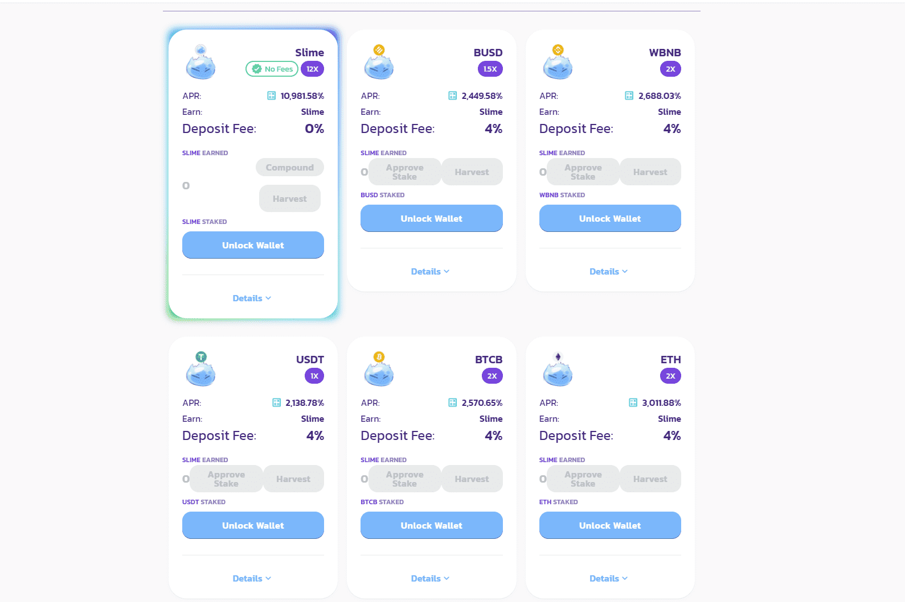

# Slime Finance

Slime Finance 是一种先进的利润分享 DeFi 协议，旨在实现多链，包括我们自己的自动做市商、NFT 市场、收益优化金库以及各种池和农场。我们的最终目标是成为满足您所有 DeFi 需求的首选多链 DeFi 中心。

我们将在币安智能链中引入 slimes，bsc 很好，但它需要一些 slimes 才能更好！
首先，我们将使用 pancakeswap 的分叉启动农业，接下来我们计划启动金库和游戏！
代币经济学
我们将从0开始！没有预售，没有预售，什么都没有！
农场开始时每块 0.314 史莱姆分布在所有水池中，我们计划在第一个月后减少排放！

