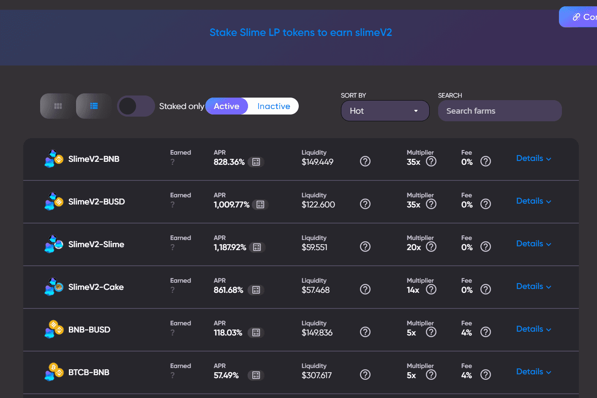

# Slime

我们的升级和创新原生代币具有强大的通缩机制，在实施我们的 Synergetic SlimeSwap 自动做市商后不久于 2021 年 4 月 15 日正式推出，SLIME 是我们平台上的官方和主要代币。
任何 SlimeV2 传输都将由我们的 DeflationController 进行分析，它允许定义通货紧缩规则并检查该传输中燃烧的数量，这允许我们添加/删除某些操作和其他不燃烧操作的燃烧规则。SlimeV2 代币在卖出/增加流动性时燃烧 2.5%，在买入/移除流动性时燃烧 0%！如果您卖出 SlimeV2，滑点会增加 2.5% 以上！

