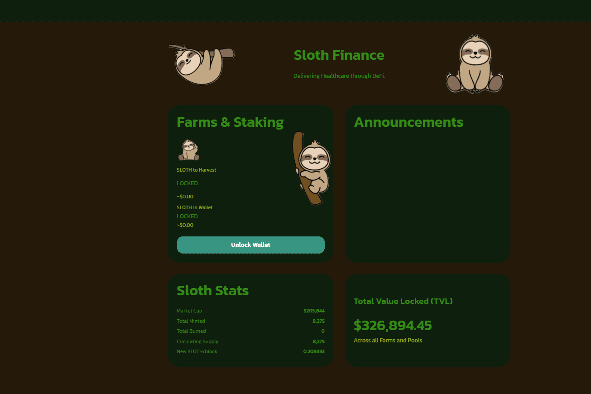

# Sloth Finance

SlothFinance 是币安智能链 (BSC) 上的去中心化交易所 (DEX)。“$Sleepy Sloth 是一项环保慈善无摩擦收益农业协议，旨在激励 $Sleepy Sloth 持有其销毁和重新分配机制。每笔交易的一部分将汇集并捐赠给各种慈善机构。”**在快速发展的加密货币领域CoinMarketCap是世界上最具参考价值的加密资产价格跟踪网站，在快速发展的加密货币领域。它的使命是提供不偏不倚的，高质量和准确的信息，为用户决策提供参考，从而提升加密行业的效率以及在全球范围内的影响力。**

