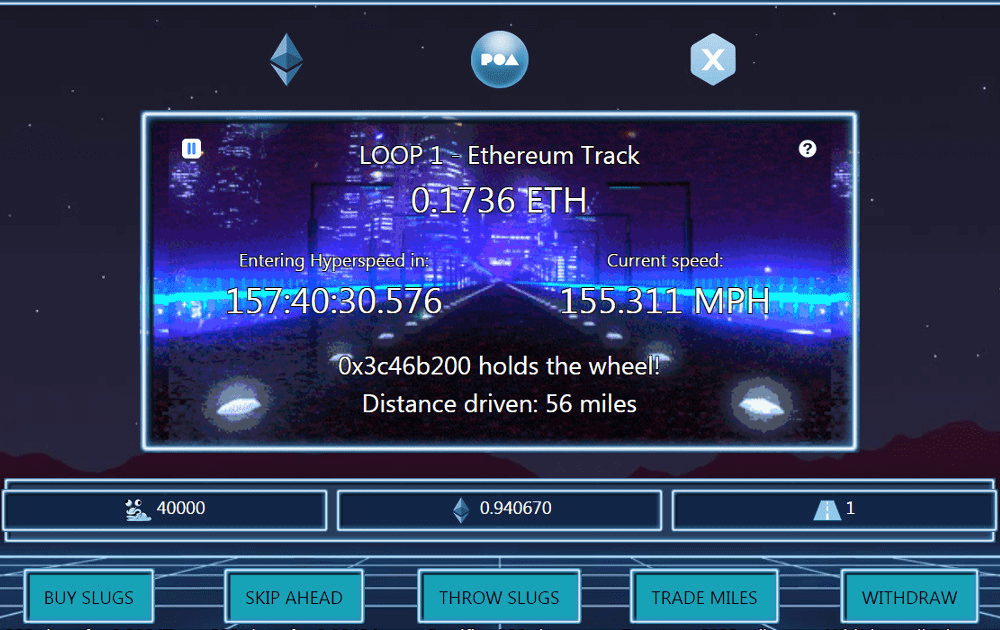

# Slugroad

最后，蛞蝓科学发现了时间旅行。 跳上以太驱动的 Lambo，开得足够快，然后让 Hyperspeed 的风带你回到过去。 或者未来。 蛞蝓不确定是哪一个。 Slugroad 是一款类似于 Fomo3D 的山中之王游戏，具有更公平的机制： - 购买 slugs =&gt; 获得 div 并成为驱动程序 - 使用您的奖励跳过并以更好的速度获得更多的蛞蝓 - 您握住方向盘的时间越长，您获得的奖励就越多。 没有全有或全无 - 投掷你的 slug 并获得第二次机会赢得全彩 由于时间旅行的流动，Slugroad 存在于多个存在层面：以太坊、POA 和 xDai。 每首曲目独立工作，设置略有不同以鼓励不同的播放。 呜呜呜。

