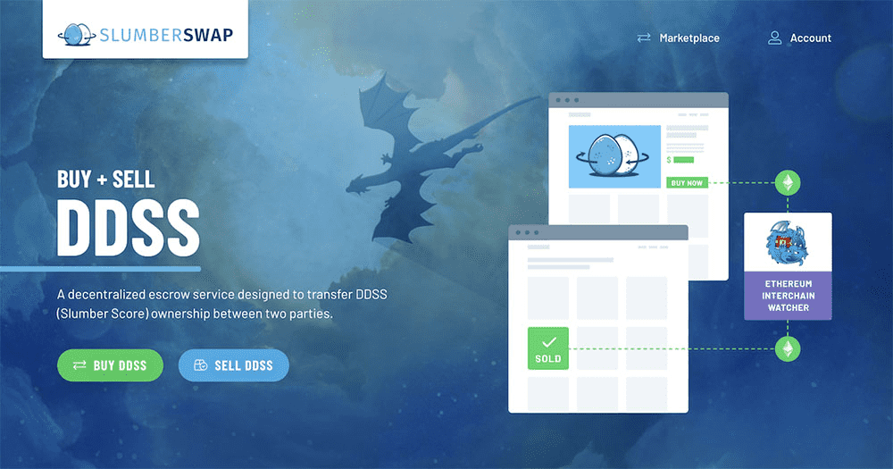

# Slumber Swap

Slumber Swap 是一个去中心化的市场，旨在在两方之间转移 Dragonchain 的 DDSS（Slumber Score）的所有权。 Slumber Swap 的定制智能合约建立在 Dragonchain 之上并与以太坊互链，让任何人都可以在一个简单而安全的庄园内买卖 DDSS+DRGN。 以太坊智能合约提供去中心化的托管服务，以在转移过程中保护资金。 DDSS 在 Dragonchain 社区中具有很大的价值，它为用户提供了早期启动节点的访问权、参与 Takara 的资格、DragonDen 内增强的声音等等。

