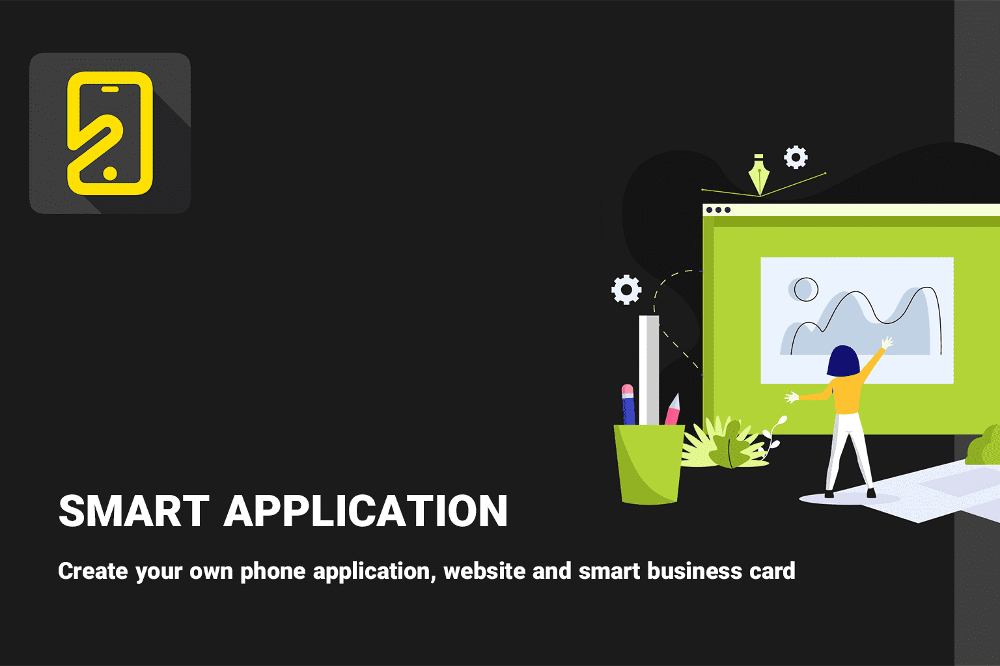

# Smart Application

创建您自己的智能名片、网站设计和电话应用程序。
智能应用程序是一个平台和解决方案，用于推出廉价而优质的网站、应用程序和智能名片。
完成表格并付款后，我们的合作伙伴将通过电子邮件向您发送所需的用户名、密码和培训。
初始设置和规格发送将在 24 小时内发送给您。 如有延迟，请联系支持人员。

什么是智能应用程序？ 智能应用程序（也称为智能流程应用程序或智能应用程序）是一种以动态方式利用数据来收集见解和增强用户体验的软件。 请注意，在任何给定的智能应用程序体验中，用户很可能是一台机器。

