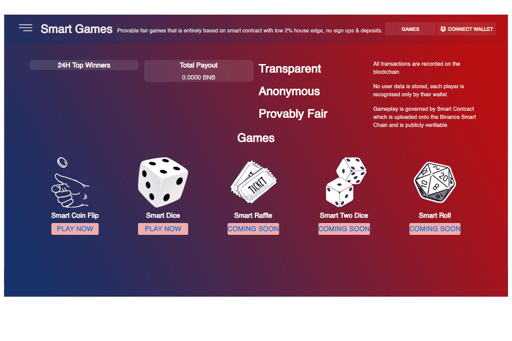

# Smart games

可证明的公平游戏，完全基于智能合约，房屋优势低，无需注册和存款。
无需 KYC VPN 友好 非托管 存款和取款不收费 可证明的公平 即时支付 100% 基于智能合约 - 无黑盒 低屋优势

SmartGames 是多层次的逻辑游戏。 每个游戏都有一个独特的机制，其主题将吸引男孩和女孩以及成年人。 它们有不同的尺寸和材料可供选择：由塑料或木材制成。

嘉宾投稿：Gernot Körner，“Play and Learn”主编学校重新开始：您如何为孩子做好准备？
我们为真正的冒险家提供的 SmartGames 创新事件：SmartGames 岌岌可危！ 在多特蒙德
下雨时如何让您的孩子玩这个蜂鸣器？
我们的暑假 SmartGames 游戏提示

