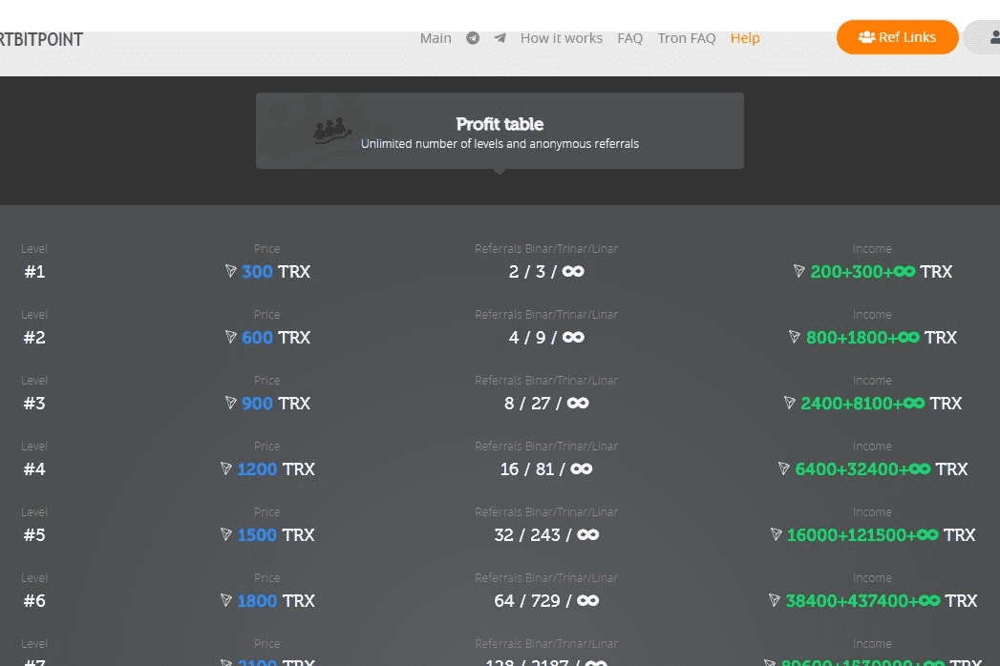

# SmartBitPoint Tron

什么是 SmartBitPoint？
SMARTBITPOINT 是第一个基于智能合约的多营销矩阵国际项目，具有三种结构：二元、三元和线性（三者同时工作）。所有营销类型的级别数量都是无限的。
SMARTBITPOINT 是 100% 去中心化的，因为它没有负责的经理或管理员。只有创建者与其他人是完全相同的项目参与者。所有资金都在参与者之间分配，并且在区块链网络内没有佣金。这 100% 证实了项目的透明度、长期可靠性和完整性。
正如您已经了解的那样，SMARTBITPOINT 项目旨在实现可观的、快速增长的收入。对于那些不喜欢在低收入上浪费时间并决心充分利用他们的利润的人！您的收入不限于任何东西，绝对没有人。
对于那些想在家工作而不依赖任何人的人来说，SMARTBITPOINT 是一个不错的选择。

