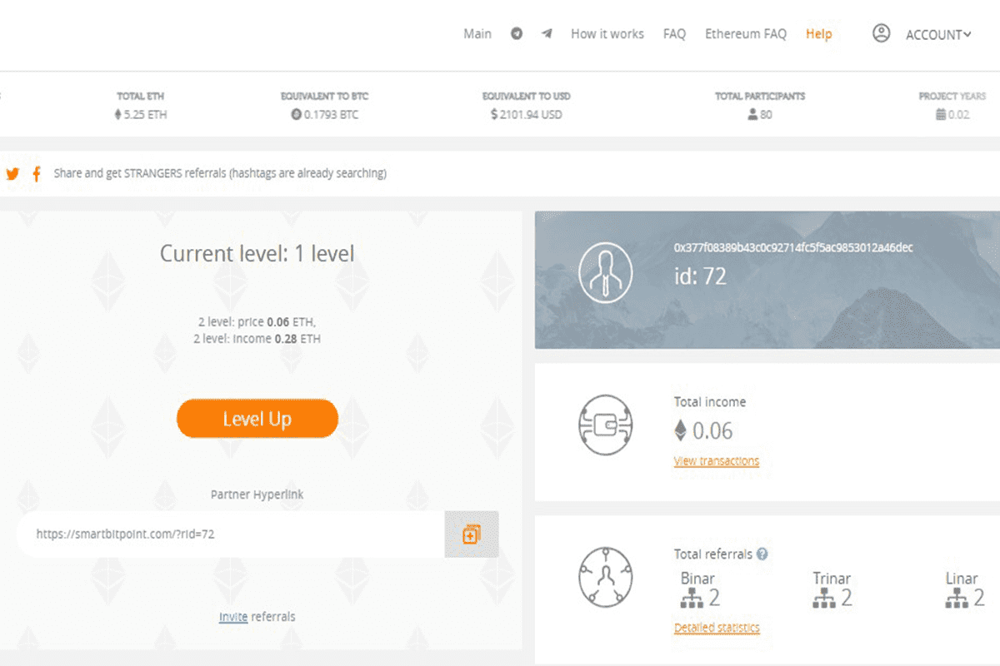

# SmartBitPoint

SMARTBITPOINT 是第一个 100% 去中心化矩阵，基于以太坊智能合约的国际项目，具有最有效的多重营销：二元、三元和线性（三者同时工作）。所有营销类型的级别数量都是无限的。
SMARTBITPOINT 是 100% 去中心化的，因为没有经理或管理员负责。只有与其他人完全相同的项目参与者的创建者。 Bce 资金在区块链网络内的参与者之间分配，无需佣金。这 100% 证实了项目的透明度、长期可靠性和完整性。
正如您已经了解的那样，SMARTBITPOINT 项目旨在实现可观的、快速增长的收入。对于不喜欢把时间花在微薄的收入上，决心最大限度地榨取利润的人！您的收入不限于任何东西，绝对没有人。
对于那些想在家工作而不依赖任何人的人来说，SMARTBITPOINT 是一个不错的选择。在 2020 年疫情如此不利的时期，这一点非常重要。

