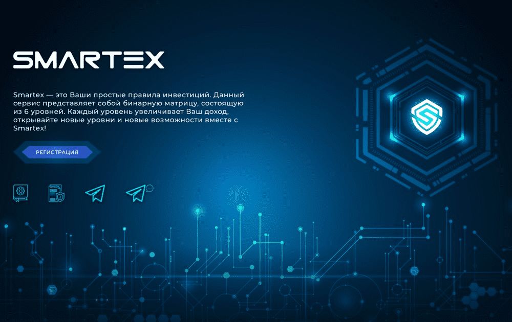

# Smartex

Smartex 是您投资的未来。 资金流通的所有规则都在智能合约中制定，完全消除了风险和不确定性。

易趣？ 在 eBay 上查看 Smartex。 不到 10 美元。 顶级品牌。 卖出时赚钱。 轻松退货。

类型：时装、汽车、电子产品、体育用品、玩具、家居和园艺

历经两年的研发和试运行，明及电气于2010年5月正式面向市场推出了中压[真空断路器](https://baike.baidu.com/item/真空断路器/3068632)新品---SmartEx，这是一款在技术层面上有显著突破的新一代智能型真空断路器。相对于市场上的普通断路器，SmartEx具有实时在线监测功能，其功能价值首先表现在可以对断路器运行状态是否完好、有无潜在故障实施同步在线监控，确保断路器可靠安全地运行；另外，作为输配电核心元件之一的断路器，具备在线监测的感知功能是未来智能电网的基础要求。以下对SmartEx作一个简要介绍。

