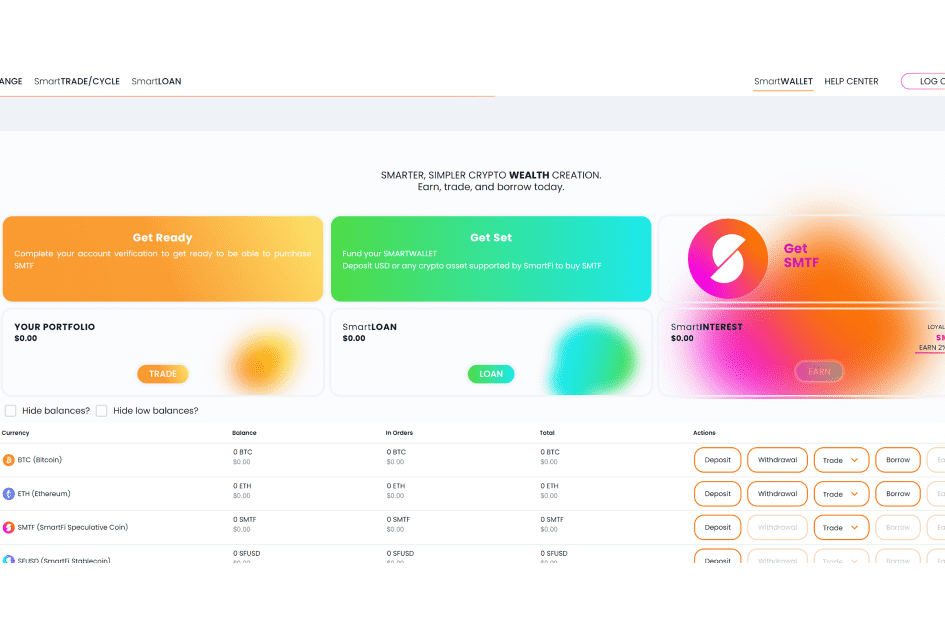

# SmartFi

SmartFi 独特的借贷流程为加密货币持有者提供法定流动性，而不会放弃加密货币的所有权。 通过独特的借贷模式，SmartFi 代币 (SMTF) 可以抵抗熊市波动。
在特定条件下，SmartFi 独特的加密货币货币政策 SmartFi 代币具有 100% 回购保证。 这保证了 SMTF 持有人的原始购买价格。
SmartFi 创建了一个独特的金融模型，通过其 100% 回购保证（保证 SMTF 持有人收回其原始购买价格）和通过将 SMTF 与 SmartFi 贷款的价值挂钩来创造投机性价格上涨来创建具有安全性的 SmartFi 代币 (SMTF) 文件夹。 这使得购买 SmartFi 代币更简单、更安全。

