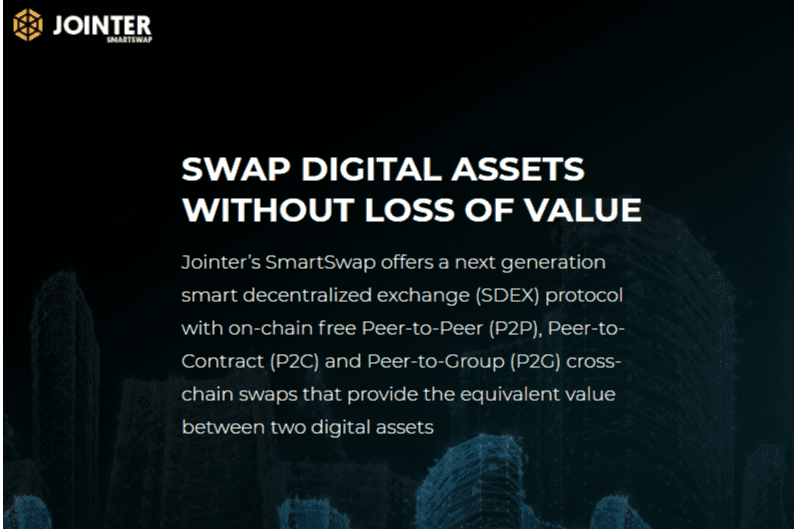

# SmartSwap

Binance Smart Chain to Ethereum ONE CLICK 和 1:1 交换，在 PancakeSwap (BEP20) 和 UniSwap (ERC20) 之间创建跨链共享池。 通过向 BSC、JNTR、JNTR/b 和 JNTR/e 添加 UniSwap 流动性，投资者将获得连接 ERC20 和 BEP20 池的新 DeFi 选项。 利用 SmartSwap 为投资者提供了池之间的套利机会。

一键去中心化多链智能交换
通过 P2P 和 CeDeFi 进行滑点或无滑点交易可获得最佳多链价格

SmartSwap 是一个循环经济和回收社区，旨在通过让用户回收产品而不是购买新产品来改变人们的消费习惯，从而减少人们的生态足迹。

