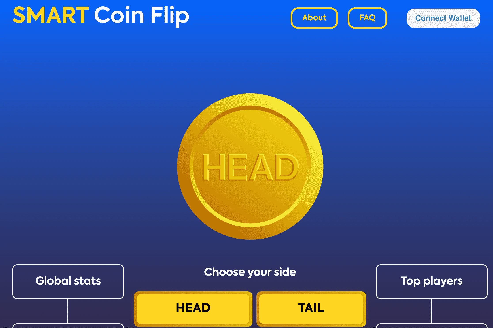

# Smartwin

Smartwin 是一个基于 Avalanche C 链的去中心化娱乐平台。 所有游戏机制均由智能合约提供支持，使其清晰公平。 区块链的开源特性使得证明所有过程的随机性和公平性成为可能。
平台上的第一个产品是抛硬币游戏。
Smart Coin Flip 是一个去中心化的应用程序，允许用户使用 $AVAX 玩正面或反面。 赔率为 50/50，费用为 3%，部分与 Smart Coin Flip NFT 持有者分享。 每笔交易都通过智能合约进行检查。
其他产品正在开发中，待定。

