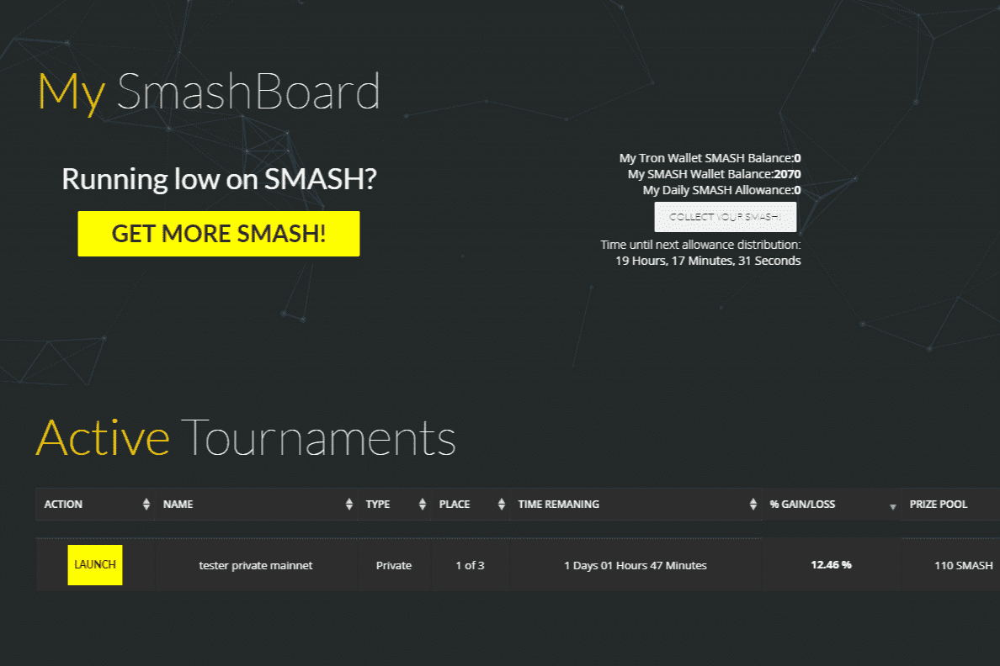

# SmashTraders

SmashTraders 是一款快节奏、基于技能的加密货币交易游戏，可让您创建并参加自定义锦标赛。 与世界各地的人们对战并赢得真正的加密货币。 只需玩游戏即可收集每日 SMASH。 注册即可获得 5 个免费 TRX。

关于实施以用户为中心的经济增长模型的一些花絮
当我们着手开发 SmashTraders 时，我们想创建一个有趣的基于区块链的加密交易游戏，它有几个关键元素：

真实的交易体验——实时
能够应对快节奏的比赛
奖励优秀的交易者，但对所有用户透明和公平
可定制 - 用户可以加入和创建各种类型的锦标赛
交互的
免费玩，甚至通过玩更好地赚钱
整合有效的基于成就的奖励系统

