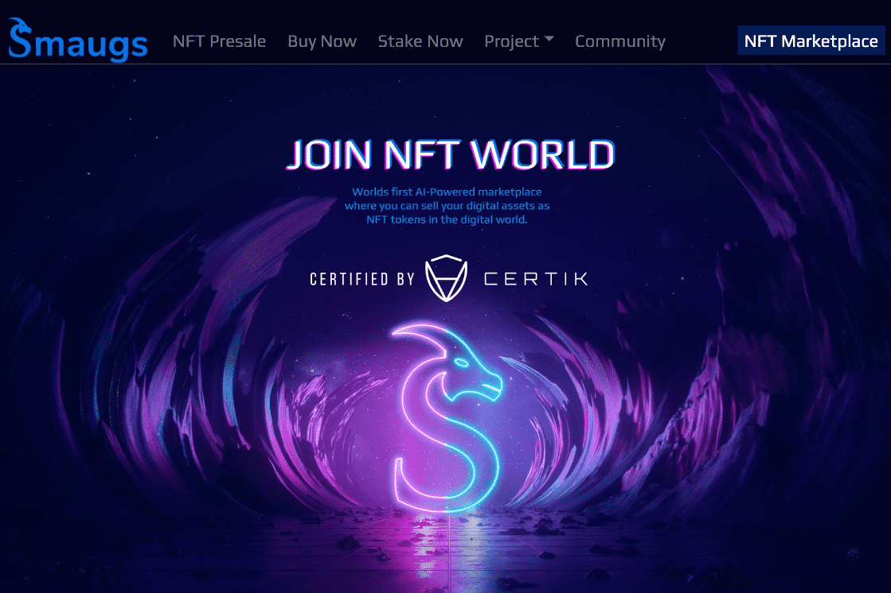

# Smaugs NFT

Smaugs NFT 是一个市场，您可以在其中出售其在数字世界中的所有资产。 Smaugs 市场正在开发 Binance 智能链并完全去中心化。 您可以使用 Smaugs NFT 市场将您在数字世界中的资产转换为 NFT 代币，并获得许多不同的礼物
我们将在 8 月发布一款新的基于区块链的竞技场游戏。

Smaugs Marketplace 是一个完整的自定义 DeFi、治理和 NFT 生态系统 + 市场。

今天的 Smaugs NFT 实时价格为 0.000625 美元，24 小时交易量为 40.82 美元。 我们将 SMG 实时更新为美元价格。 Smaugs NFT 在过去 24 小时内上涨了 7.38%。 当前的 CoinMarketCap 排名为 #2462，实时市值为 21,891.03 美元。 它的循环供应量为 35,000,000 SMG 代币，最大。 供应 100,000,000 SMG 硬币。

