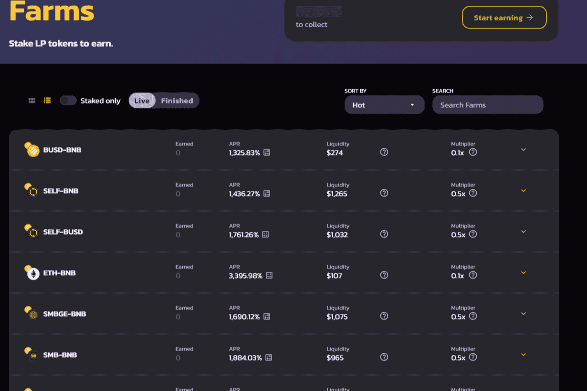

# SMBSwap

什么是 SMBSwap？
SMBSwap 是币安智能链上的去中心化交易所（DEX）。 通过收益耕作赚取 SELF 或在彩票中获胜，然后将其投入 MADE Pools 以赚取更多代币！

探索 SMBSwap，这是 BNB 智能链 (BSC) 上增长最快的 DEX，拥有最好的 SELF 农场和 DeFi 中的制造池。 BSC 上最热门的新 AMM！ 通过收益耕作赚取 SELF，然后将其投入 Made Pools 以赚取更多代币。 交换、质押和赚钱——所有这些都在您可以信任的平台上进行。

与比特币和以太坊相比，币安区块链的交易成本要低得多。 由于 SMBSwap 在 Binance 网络上运行，我们的用户享受的交易费用通常低于大多数其他去中心化交易所。

