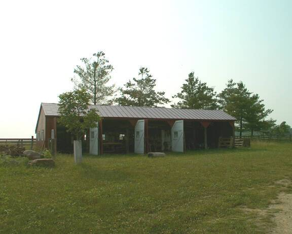

# Smithery Farms

Smithery farms defi 是雪崩网络中一个新的多层 defi 平台。 它利用其独特的空投系统来保持价格稳定，避免价格大幅下跌，让投资者获得丰厚的收益。 我们文档中提到的这种独特的空投系统将继续用于所有层，并确保我们所有的层代币在我们的进一步层中都具有实用性。

在 Ape O'Clock 日历上列出发布始终是免费的，并且适用于任何和所有协议。 我们列出的所有发布也会自动发布到我们的社交媒体帐户。

我们不接受挂牌付款，在任何情况下都不会支持或推广任何单个项目。 我们得到了广告（横幅、项目标志）的支持，这些广告总是被贴上这样的标签。

