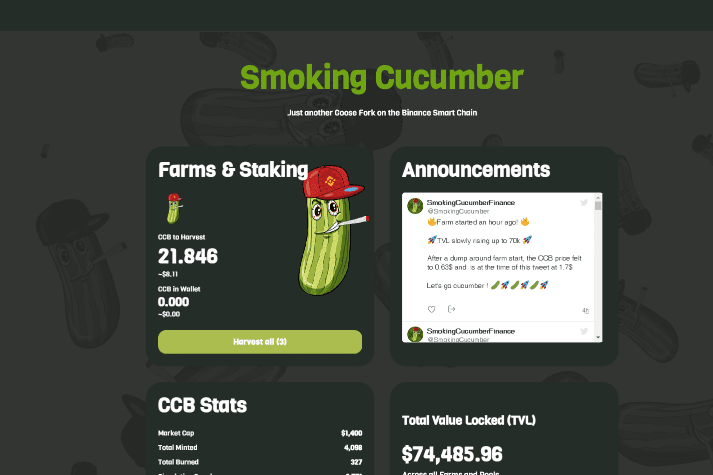

# Smoking Cucumber Finance

Smoking Cucumber Finance 是运行在币安智能链和 Pancake 交换交易所上的去中心化交易所，可让您通过收益耕作赚取代币。

吸烟黄瓜金融是一个 DeFi 项目。 它提供了赚取加密货币的机会。 这可以通过单产农业实现。

吸烟黄瓜金融是一个 DeFi 项目。 它提供了赚取加密货币的机会。 这可以通过单产农业实现。 该项目是 100% 去中心化的。 Smoking Cucumber Finance 部署在 BSC 网络上。

吸黄瓜金融 dApp 分析
触手可及的最重要的 Smoking Cucumber Finance dApp 指标 - 分析下面的深入图表，评估 dApp 在不同时间段的活动并做出快速、准确的决策！

