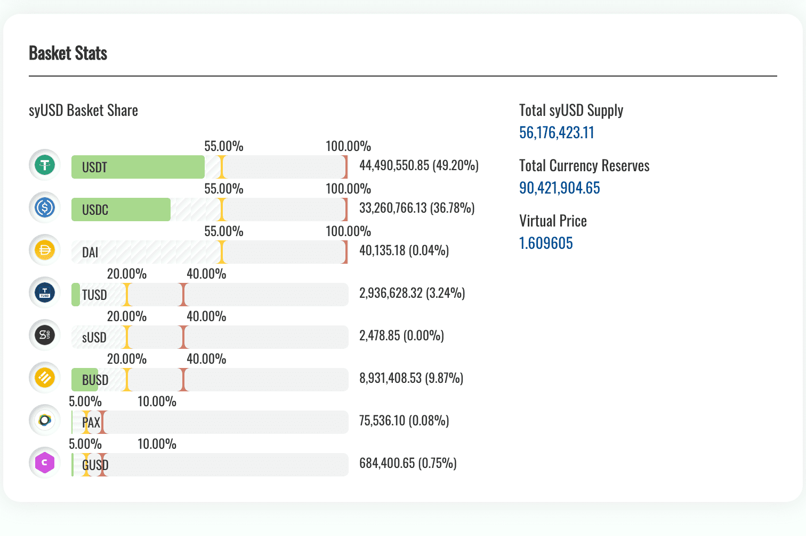

# Smoothy.finance

思慕雪的特点：
1 通过算法优化显着降低gas费用
即使部署在以太坊上，经过算法优化后，Smoothy 上稳定币兑换所需的 gas 费用相比 Curve 的 yPool 和 mStable 降低了 90%。它在不使用 layer2 的情况下实现了较低的 gas 费用，并确保了可组合性。
2 单池支持多种稳定币，流动性更好
与 Curve 在一个池中最多支持 4 个稳定币不同，Smoothy 可以在一个池中支持多个稳定币，并且可以灵活地添加/删除任何代币。理论上，Smoothy 可以在一个池中容纳数百种不同类型的稳定币（甚至是算法稳定币）。这意味着 Smoothy 不会受到多个池的分散流动性的影响，从而实现更好的流动性。
3 最大LP奖励
参考银行的准备金制度，我们设计了独特的动态现金准备金算法，将底层生息平台中的大部分资金动态分配，剩余部分预留用于满足日常掉期需求。换句话说，除了治理代币收益外，流动性提供者还可以获得掉期费用以及利息收入和较低的汽油费。
4 零滑点交换算法
Smoothy 开发了 SmoothSwap 算法，如果池中代币的百分比低于软权重，大部分时间可以保证 1:1 的比例交换；如果没有，仍然允许通过对滑点征收罚款来进行掉期。

