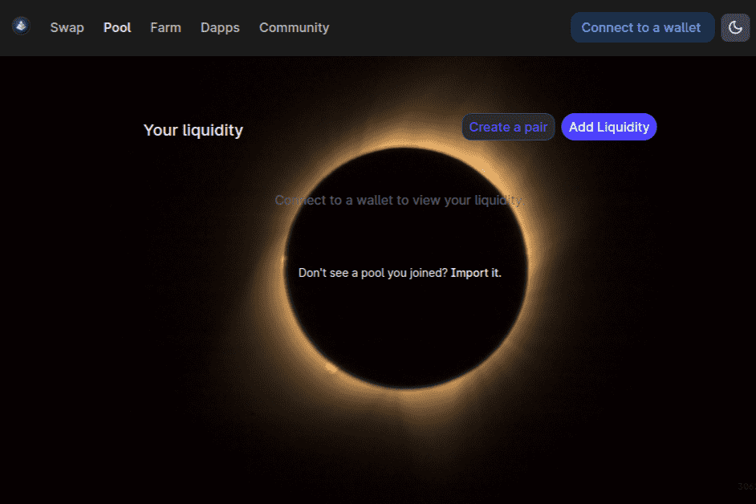

# SMXSwap

SMXSwap 是 Uniswap V2 协议的一个分支，由 Stronghands Money 定制并部署到 Cronos！ 创建并质押 Strong-LP 代币以赚取 DEX 自己的通缩代币 SMX。 低交易费用和时尚的前端为 Cronos 提供高效可靠的交易体验——所有收取的交易费用都用于 Stronghands Money 生态系统的各个部分，以增加协议拥有的流动性和价值。

值得信赖的合作伙伴，在我们的 DNA 中拥有先进技术
SMXTM 既是一个平台，也是一个能力增强器，让您能够实现自己的目标，无论目标多么广阔。 我们是：

对齐的影响
解决方案和交付模式完美结合，以解决您最棘手的挑战

