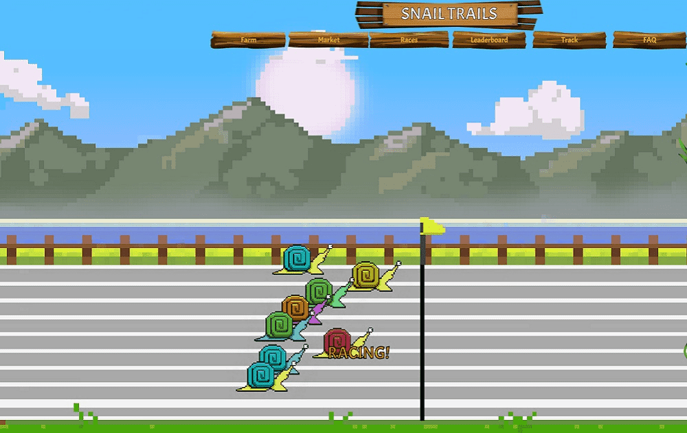

# Snail Trails

Snail Trails 是一款拥有自己经济的多人游戏，玩家可以通过训练、繁殖、销售和赛跑蜗牛来赚钱。游戏的第一部分我们不考虑赌博，因为每只蜗牛都有能力为其主人赚取收入。通过比赛找到蜗牛隐藏的属性取决于个人。对于那些只想赌博的玩家，有一个累加器 (Tote) 可以赢取所有比赛的实时红利。每只蜗牛在比赛中的能力都是基于它们的属性。例如，找出您的蜗牛最喜欢的车道将导致更好的比赛成绩，从而使其更有机会成为获胜者。蜗牛有7个属性加上少量的X因子。总计后，蜗牛将获得总比赛成绩和最终完成位置。蜗牛也根据他们获得的最高比赛分数进行评分，因此当蜗牛与自己的能力竞争时，比赛将始终具有竞争力。此外，我们还举办特别活动，广告商在一周内赞助多场比赛，为奖池增加额外的现金以供分享。最后，所有玩家都可以通过被动挖掘SHELLS来拥有一条Snail Trails，每日分红。

