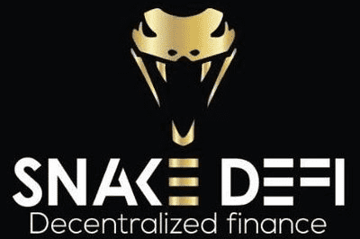

# Snakedefi

Snake Defi 是基于币安链的去中心化互换交易所。 在这里，您可以安全地为您的项目添加最成功的代币互换和流动性。 Snakedefi 因其 psitive 功能而脱颖而出，例如删除 rugpull 代码或 24 小时时间格洛克。 其他 Snakedefi 项目也将在未来出现。

Snake DeFi 是一个去中心化的交易所。 它允许您在币安智能链上的不同代币之间进行交换。 用户可以将自己的硬币交换添加到 dApp。 该项目将自己推销为安全可靠。 这是 Snake DeFi 项目系列的第一部分。

