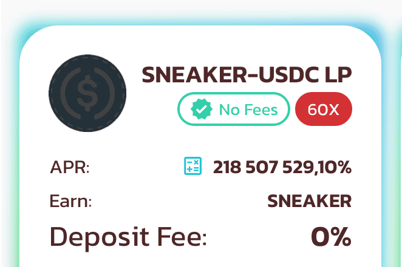

# Sneaker Finance

Sneaker Finance 是最早基于 Polygon 的 Yield 农业之一

我们听说有人为他们的汽车和房屋融资，这是有道理的，因为这是一笔相当大的开支，许多人认为这是必要的。现在事实证明，当您没有足够数量的纸张进行购买时，您将能够为购买运动鞋提供资金。

Flight Club 现在让您有机会在线为您的运动鞋融资。 Flight Club 看到并设想了一个商机，无疑会看到他们的销售额增长。这将使人们即使目前没有钱也可以购买鞋子。

如果您不熟悉融资的运作方式，它基本上可以让您通过从信贷公司借钱并连带利息偿还他们的钱来购买商品。

Flight Club 现在为他们的客户提供购买运动鞋后长达一整年的融资选择。以您在上图中看到的 Fragment 1 为例。您可以通过 AFFIRM 为他们提供资金，每月支付 123.01 美元，而不是在结账时支付 1,400 美元。

按照这些简单的步骤，您可以使用 AFFIRM 为 Flight Club 的运动鞋提供资金。

