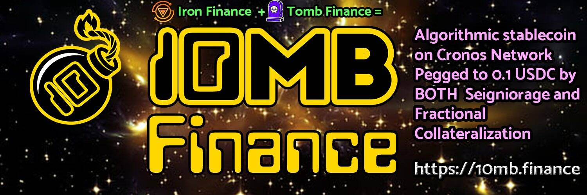

# Snowcat DAO

Snowcat 是一个 DAO，其排放仅持续 8 天，并以总计 80% 的国库的大规模回购结束。管理员没有提款能力，所有回购都由自定义代码执行。在所有回购完成后，SCAT 成为 Avalanche 生态系统的 meme 代币。

铸造/粘合可使用 5 天。您可以通过铸造、质押或从市场购买来积累 $SCAT。将征收 8% 的销售税，按比例重新分配给所有质押者。铸造归属期限为 3 天（而不是通常的 5 天）。

不能通过绑定来铸造更多的 $SCAT。尚未兑换的 $SCAT 仍可兑换。质押保持不变。

不能再从任何来源将 $SCAT 添加到供应中。在除 SCAT-DAI LP 之外的所有国库资产中，80% 受代码约束，用于在 24 小时内进行大量回购和销毁。 20% 发送给项目管理员，其中一部分将用于慈善捐款。将使用特殊功能触发随机定时和大小的回购，以确保透明和公平地使用 SCAT-DAI 流动性池。然后，$SCAT 将成为 AVAX 的模因货币，通货紧缩的供应通过重新分配销售税来奖励质押者。

