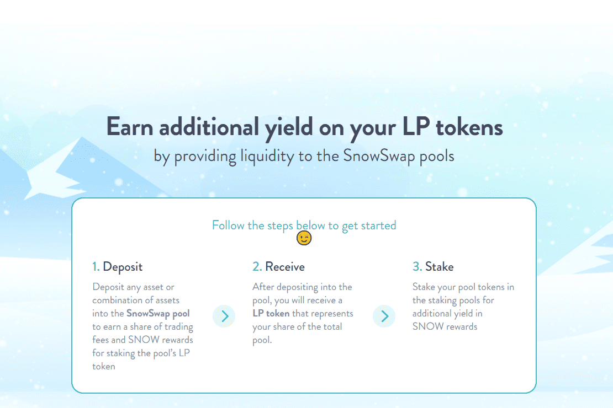

# SnowSwap

SnowSwap 专为低滑点稳定币掉期而设计，基于 Curve 的 AMM。通过为 yVault 稳定币创建池，交易者可以轻松地在不同的金库之间进行交换而无需支付提款费，并且可以通过交换到具有足够大代币储备的金库然后提款来廉价地退出头寸。 SnowSwap 用户还可以通过充当 LP 来分散多个稳定币金库的收益，还可以通过交易费的形式获得额外收益，最初设定为每次掉期 0.04%。SnowSwap 是以太坊上的一个交易所流动性池，旨在：极其高效的稳定币交易、低风险、流动性的补充费用收入......

