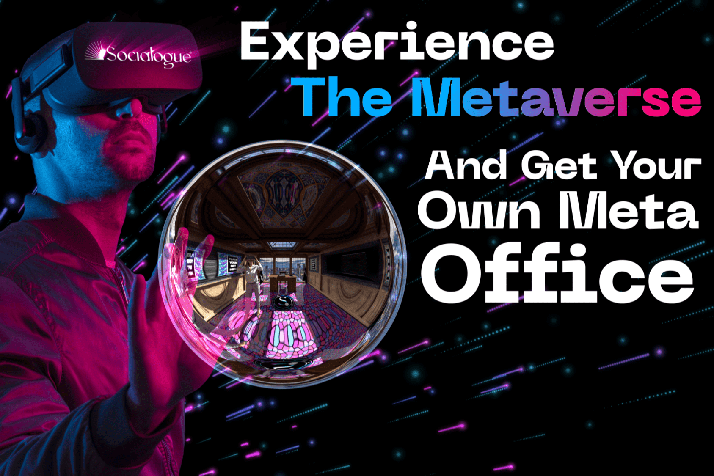

# Socialogue

Socialogue 是一个与 Metaverse 集成的社交 NFT 市场。 Socialogue 是一个革命性的平台，结合了蓬勃发展的市场——NFT、社交媒体和元界，这些市场正在迅速发展和变化。结果，出现了许多问题和未开发的机会。 Socialogue 以其功能和以客户为中心的态度解决了这些问题。
该团队使用领先的技术、编程语言、集成和方法来开发一个全面且完美的操作平台。 Socialogue 主要建立在以太坊上，提供第 2 层，此外，它还应用了多链集成，允许其用户创建、销售和交易 NFT，并从各种区块链中进行选择。
Socialogue 的 Metaverse 将平台与其他平台分开。通过进军艺术画廊，Socialogue 正在开拓另一个巨大的市场。 Socialogue 即将成为虚拟艺术和慈善展览、拍卖、会议以及音乐和励志活动的一站式解决方案。关键点——将区块链整合到元界中，Socialogue 的用户可以在不离开元界的情况下展示、销售和购买数字艺术和 NFT。
Socialogue，作为一个实际的 Web 3.0 项目，创造了一个机会，可以将在平台上花费的时间货币化。为了实现 Socialogue 的所有功能，需要一个 $SLG 实用代币，它可以被所有用户获取。该代币可以在 Socialogue 的平台、Marketplace 和 Metaverse 上使用。 $SLG 代币为 Socialogue 的用户和代币持有者带来了大量的用例和好处。
Socialogue 已经取得了重大成就，但团队并没有就此止步。随着未来前景的发展，例如 Socialogue 的 NFT 启动板的开发、将 Logue（Socialogue 上的帖子）转变为 NFT 的实施，以及正在进行的新合作，Socialogue 将继续发展。

