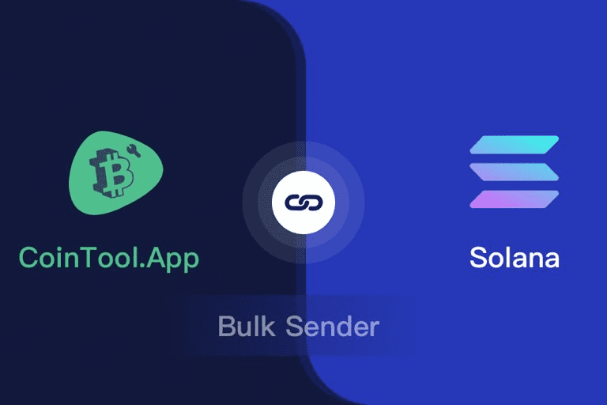

# Solana Multisender

易于使用的 dapp 向 solana 网络中的数千个地址发送/空投 sol 和 spl 令牌，非常省时，只需像幻像这样的交互即可完成，无需接触私钥，保证安全Solana 多发送器。通过智能合约将代币从一个地址批量发送到数千个地址，适用于 solana 空投或代币分发。solana multisend 允许在一个设置中将 SPL 代币、NFT 和很快 SOL 的无代码分发系统/dapp 发送到多个地址。使用 Token Multisender 在 1 次交易中将 ERC20 代币或 ETH 发送到数千个地址。批量传输erc20。

