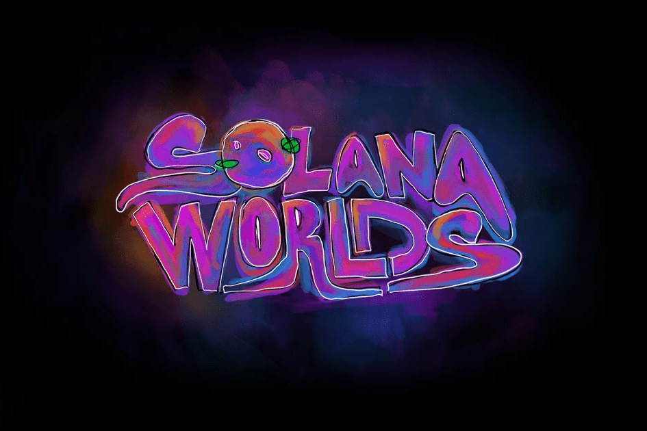

# Solana Worlds

每个世界都是由 200 多种不同的数字绘画和摄影属性通过算法生成的。
没有两个世界是相同的。
所有权证明永久存储在 Solana 区块链上。
世界由银河、行星、卫星、流星和科技组成，每一个都有 5 个不同的稀有度等级。SolSea 是 Solana 上最大的 NFT 平台，引入了具有嵌入式许可证、最低交易费用和来自链上数据的实时分析的 NFT。探索。2,222 个独特的 Solana 区块链女英雄的原始 NFT 集合。 https://discord.gg/ ... Tenkai Apes X World Of Solana Honorary 的团队。

