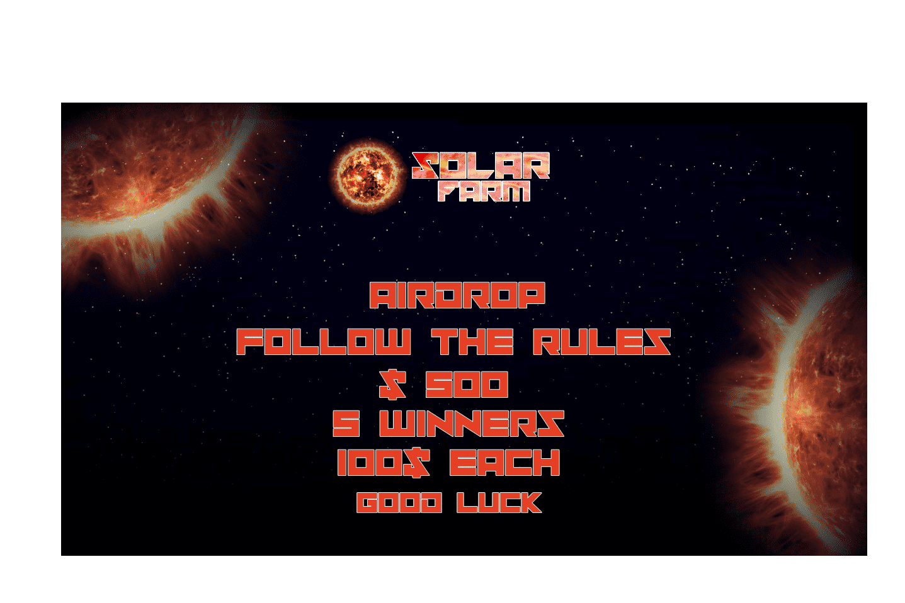

# Solar Farm

收获锁
最大供应
Defi安全项目太阳能农场是大量的光伏 (PV) 太阳能电池板，它们从太阳中吸收能量，将其转化为电能并将电能输送到...2019 年 4 月 30 日 — 太阳能农场是大型太阳能装置，其中光伏 (PV) 面板（称为太阳能电池板）或其他收集方式。2022 年 5 月 19 日 — 太阳能农场是大型的地面安装太阳能装置。他们使用光伏 (PV) 面板或其他收集太阳能的方式，...2022 年 5 月 19 日 — 太阳能农场是大型的地面安装太阳能装置。他们使用光伏 (PV) 面板或其他收集太阳能的方式

‎
‎
