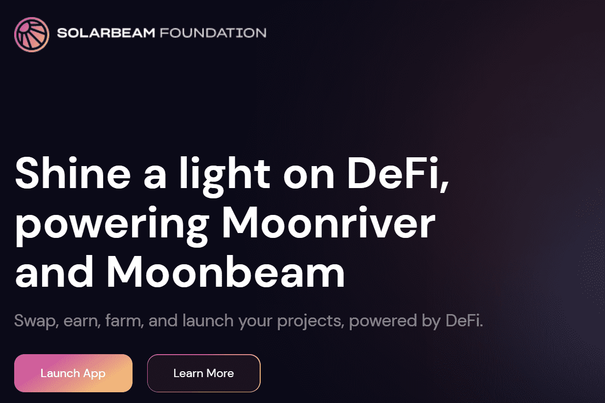

# Solarbeam

Solarbeam 是一个去中心化交易所，提供流动性并支持 Moonriver 网络上的点对点交易。我们目前是网络上领先的 DEX。
目标是为加密货币社区提供一个全面便捷的一站式平台。
Solarbeam 允许用户直接从他们的钱包进行交易，而不是通过第三方进行交易——代币永远不会离开你的托管意味着它 100% 归你所有。
较低的交易费用使 Solarbeam 成为一个有吸引力的交易平台。
更高的流动性还有助于为加密社区的各个方面提供广泛的支持，并通过继续为代币持有者和社区提供价值来不断适应市场

