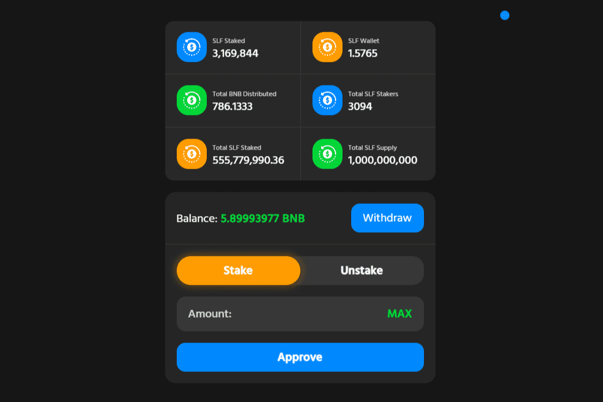

# Solarfare

Solarfare (SLF) 是一种 BEP-20 代币，具有 LP 收购、质押赚取 BNB 以及对 Binance 钱包的慈善捐款。我们的 DApp 位于我们的网站上，可用于轻松质押您拥有的任何 $SLF 以赚取 BNB，没有风险，也没有锁定时间。
Solarfare 的一半税收以 BNB 的形式按比例分配给质押者。您可以随时进行质押、解除质押和提款，无需缴税，也无需锁定期——使其无风险。
我们还提供了一个易于使用的 UI，具有出色的用户体验，这使得在所有设备上都可以轻松锁定和跟踪您的进度。

