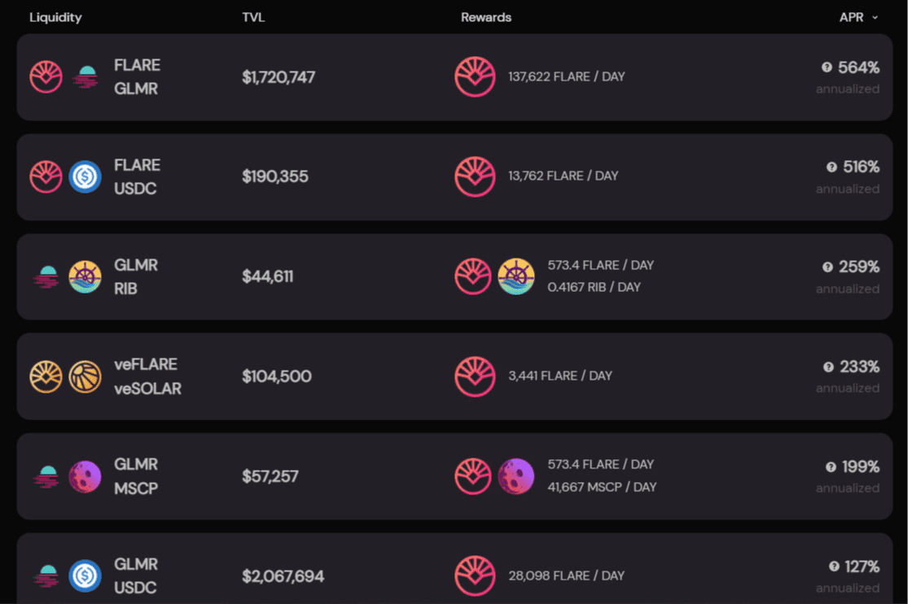

# Solarflare

Solarflare 是一个去中心化交易所，提供流动性并支持 Moonbeam 网络上的点对点交易。目标是为加密货币社区提供一个全面便捷的一站式平台。以太网适配器。通过收购低延迟网络和应用程序加速开发领域的先驱 Solarflare ...... 开发领域是通过低价格和延迟网络应用程序加速的Solarflare 允许在 Moonbeam 上交换兼容的代币。 ... Solarflare 标志。 SwapPoolFarmStakeBridgeAnalytics。 GLMR。 0.67 美元。耀斑。 0.0025 美元。Orion SolarFlare 是启动板产品的扩展。我们正在与该领域的一些最著名的发射台合作，将 IDO 汇集到 Orion ...

