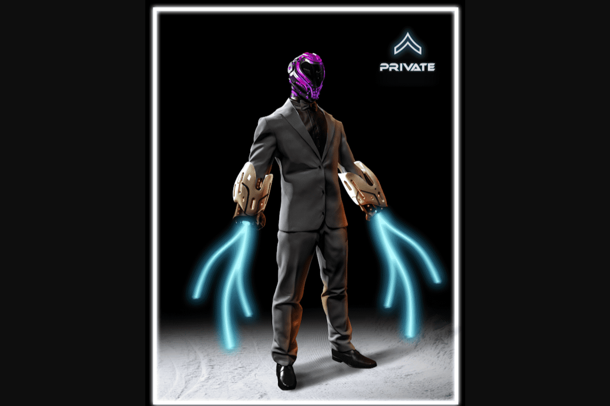

# Soldiers Of The Metaverse

什么是元节
该术语是在尼尔·斯蒂芬森 1992 年的科幻小说《雪崩》中创造的，指的是物理、增强和虚拟现实在共享在线空间中的融合。简而言之，元宇宙是社交参与、商业和游戏的未来。子孙后代永远不会知道没有它的世界，他们生活的方方面面都会以某种方式触及它。它是创新的前沿，也是当今世界每个主要企业的重中之重。
谁是这支军队的士兵
随着所有这些令人难以置信的创新的建立，只适合引入一支准备不惜一切代价保卫元宇宙的军队——我们的士兵。作为开创性的#MetaArmy，这些士兵将站在未来的前线。每个士兵都是从 150 多个特征中随机生成的。每一个都是独一无二的，所有者拥有版权/许可机会的份额，如动作人物、商品甚至屏幕时间。这将是“旧”世界所见过的最强大、最富有的军队。士兵具有不同于您之前可能见过的其他生成集合的特征 - 关注他们的完整体格和武器库，而不仅仅是他们的脸。这支军队是思考生成集合可以是什么的革命性方式。

