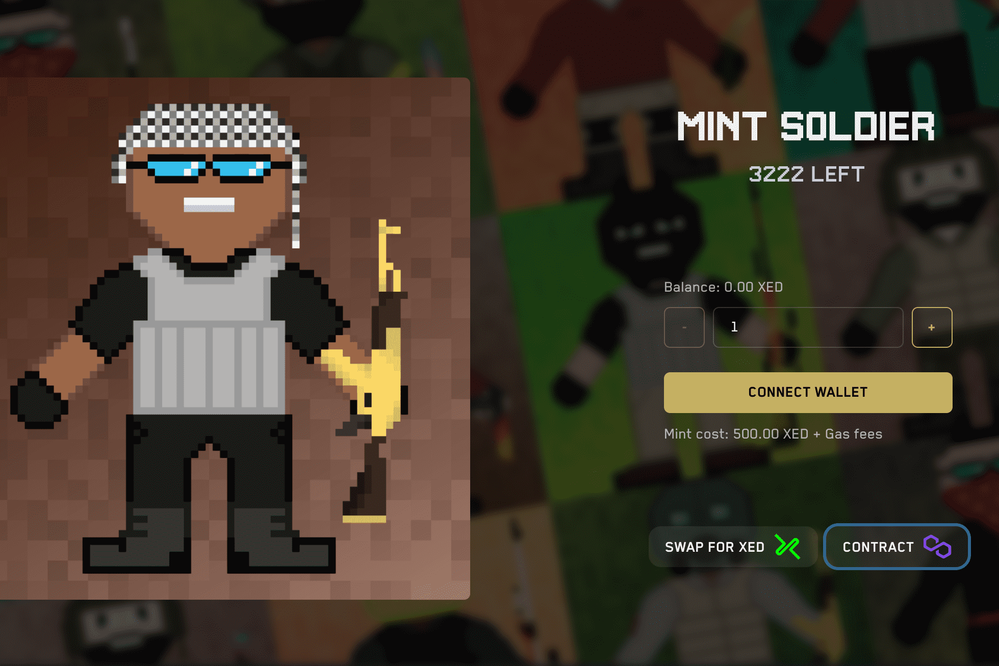

# Soldiers Society

士兵协会是由 3333 名独特的像素艺术 NFT 士兵组成的有限营——生活在 Polygon 区块链上的独特数字收藏品。你的士兵不仅是你的化身，也是你的社团成员，为所有游戏玩家和一个开放的元宇宙而战，让你可以使用能够实现这场战斗的工具。在汉诺威即位和滑铁卢战役之间的那个世纪里，这位英国士兵是一个迷人而复杂的人物。 “战争与社会”...英国士兵：重新思考战争与社会，1715-1815 年（18 世纪世界 LUP）[Linch, Kevin, McCormack, Matthew] 在 Amazon.com 上。

