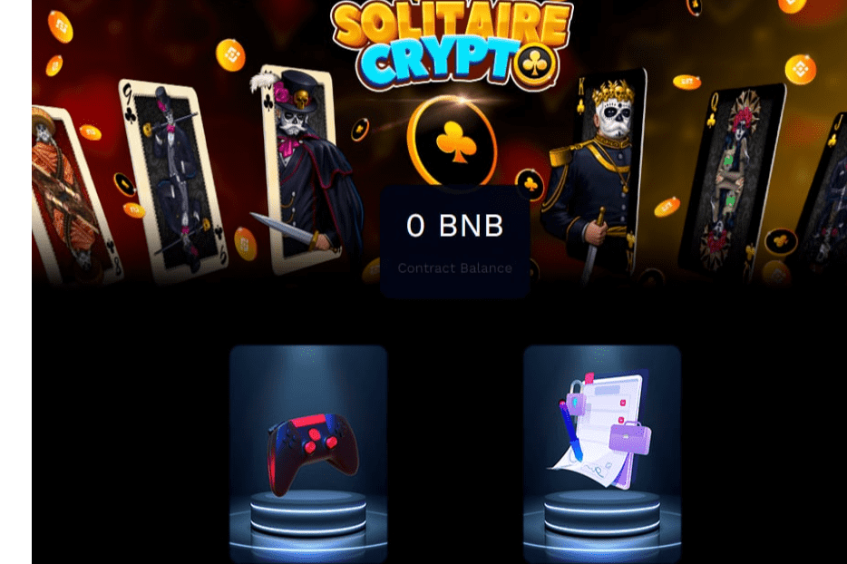

# Solitaire crypto

Solitaire Crypto 是一款在币安智能链 (BSC) 网络上运行的区块链游戏，这款游戏具有完全竞争和直观的动态，让玩家可以自动或无限地创收。
Solitaire Crypto 是第一款统一了智能合约和区块链游戏最佳功能的游戏，为属于这两个大市场的用户提供了解决方案和创新的替代方案。
Solitaire Crypto 将为其玩家提供自动或无限创收的可能性，这要归功于其经济系统，该经济系统基于高度竞争和有趣的游戏模式中相同玩家之间的循环和参与经济。
Solitaire Crypto 为整个社区带来了一个完全革命性和安全的经济系统，一个没有外部奖励代币、没有预售的经济系统，一个完全自我维持和安全的系统，您唯一关心的就是在空闲时间玩得开心.
Solitaire Crypto 将其游戏动态建立在许多人已经知道的经典、令人上瘾和有竞争力的卡牌系统上，并已成为数字商店中下载次数最多的益智游戏之一，这无疑会给我们的玩家带来数小时的乐趣。
智能合约和区块链游戏的革命已经到来欢迎来到 Solitaire Crypto。

