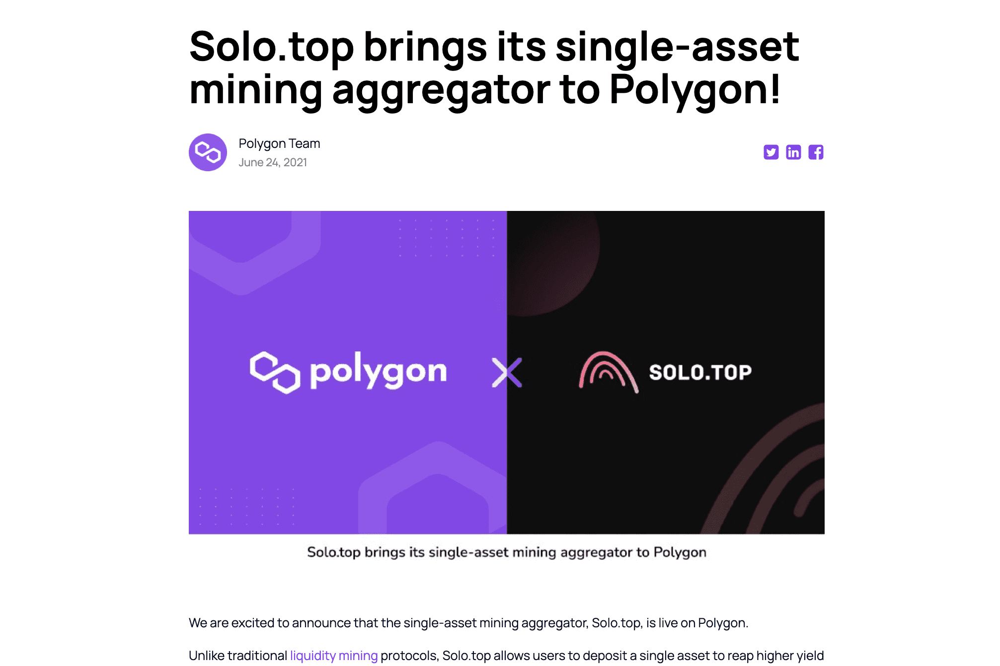

# Solo.top

Solo.top 是一个没有无常损失的单一资产挖矿聚合器。该平台具有一套易于使用的 DeFi 工具，其锁定总价值的总和和比率的增长在竞争激烈的市场中脱颖而出。Solo.top 是去中心化协议的领先流动性提供商。用户存入的单一资产将被分配到多个收益耕作池中，以...Solo.top 是一个没有无常损失的单一资产挖矿聚合器。该平台具有一组易于使用的 DeFi 工具，其在总和和 ...Solo.top 是一个没有无常损失的单一资产挖矿聚合器。该平台具有一组易于使用的 DeFi 工具，其在总和和速率上的增长......Solo.top 是一家单一资产的挖矿聚合商，其使命是以零风险获得流动性激励... 查看更多。活动； NFT合约...

